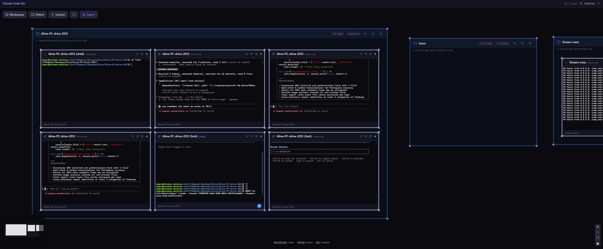

# Air Code v0.1.0

A web-based canvas for managing multiple AI CLI terminal sessions. Organize sessions into workspaces, view live terminal output, fork conversations, and collaborate with multi-user presence.



## Why This Exists

AI CLI tools like Claude Code and Gemini CLI are powerful, but working with them at scale exposes a fundamental UX gap: **they are single-session, single-window tools in a multi-context world.**

### Pain Points Solved

- **Context switching overload** — Jumping between 5+ terminal tabs to track different AI sessions is mentally expensive. Air Code puts them all on one visual canvas so you see everything at once.
- **Session blindness** — There is no way to tell at a glance which sessions are idle, running, or stuck. Air Code shows live status on each card without you having to focus each window.
- **Lost conversation threads** — When a tmux session exits or a terminal window closes, the conversation history is gone. Air Code persists sessions in SQLite and can reopen them.
- **No branching without pain** — Testing a different approach means either clobbering your current session or manually duplicating it in a new tab. The fork feature clones an active session in one click.
- **Collaboration dead end** — AI sessions are personal by default. Multi-user presence lets teammates see which sessions are active and who is looking at what, in real time.
- **Project context scattered** — Figuring out which session belongs to which project requires reading terminal titles or paths. Workspace detection auto-groups sessions by Claude project directory.
- **Windows + WSL friction** — Running tmux-backed AI CLIs on Windows requires WSL, and every path conversion is a footgun. Air Code handles the `C:\` ↔ `/mnt/c/` translation automatically.
- **Remote terminal dead zone** — Connecting an AI agent running on another machine into your local UI is not natively possible. The remote agent script bridges any machine directly into the canvas.

## Features

- **Canvas-based session management** — Drag, resize, and organize session cards within workspace bubbles
- **Real-time terminal streaming** — Live xterm.js terminals with WebSocket multiplexing
- **Dual backends** — tmux (persistent, via WSL) or native PTY (PowerShell/bash)
- **Session forking** — Branch AI CLI conversations with `--fork-session`
- **Workspace detection** — Auto-detect projects from `~/.claude/projects/`
- **Multi-user presence** — See who's viewing which session in real-time
- **AI agent** — Natural language session management via AI API
- **Canvas persistence** — Layout auto-saves every 15 seconds

## Architecture

```
Browser (:5173)  →  WAS (:7333)  →  SMS (:7331)  →  tmux/PTY
   React/xterm       API hub          Sessions        AI CLI
```

| Package | Description | Port |
|---------|-------------|------|
| `@air-code/web` | React frontend (Vite + Tailwind + ReactFlow + xterm.js) | 5173 |
| `@air-code/was` | Web Application Server (auth, workspaces, canvas, proxy) | 7333 |
| `@air-code/sms` | Session Manager Server (PTY/tmux lifecycle, terminal I/O) | 7331 |
| `@air-code/shared` | Shared types, constants, date utilities | — |

## Prerequisites

- **Node.js** >= 22
- **pnpm** (package manager)
- **WSL** with tmux installed (for tmux backend on Windows)
- **Python 3** (for kill script)

## Quick Start

```bash
# Install dependencies
pnpm install

# Build shared package
pnpm --filter @air-code/shared build

# Start all servers (SMS + WAS)
pnpm dev

# In another terminal, start the web frontend
pnpm dev:web

# Open http://localhost:5173
```

Default credentials:
- Register with invite code: `WELCOME1`

## Scripts

| Command | Description |
|---------|-------------|
| `pnpm dev` | Start SMS + WAS concurrently |
| `pnpm dev:sms` | Start Session Manager Server only |
| `pnpm dev:was` | Start Web Application Server only |
| `pnpm dev:web` | Start Vite dev server only |
| `pnpm kill-all` | Kill all dev servers |
| `pnpm build` | Build all packages |
| `pnpm typecheck` | TypeScript check all packages |

## Environment Variables

Create a `.env` file at the project root:

```bash
# Session Manager Server
SMS_PORT=7331

# Web Application Server
WAS_PORT=7333
WAS_JWT_SECRET=your-secret-here

# AI Agent (optional)
ANTHROPIC_API_KEY=sk-ant-xxx
```

See individual package docs for full variable lists.

## Documentation

| Document | Description |
|----------|-------------|
| [Architecture](docs/architecture.md) | System overview, data flows, startup sequence |
| [SMS](docs/sms.md) | Session Manager — PTY/tmux, WebSocket, database |
| [WAS](docs/was.md) | Web Application Server — API, auth, workspaces |
| [Web](docs/web.md) | Frontend — React, canvas, terminal, state management |
| [Shared](docs/shared.md) | Types, constants, utilities, project config |
| [Workspace Detection](docs/workspace-detection.md) | How workspaces are discovered |

## Platform Notes

Runs on **Windows** with tmux accessed through WSL. All tmux commands route through `wsl bash -c "tmux ..."`. Path conversion handles `C:\Users\foo` ↔ `/mnt/c/Users/foo` automatically.

The PTY backend (`backend: 'pty'`) spawns native PowerShell/bash without WSL, suitable for environments without tmux.

## Database Safety

- Databases use SQLite with WAL mode
- Migrations are additive only (never DROP)
- Never delete `.db`, `.db-wal`, or `.db-shm` files
- SMS DB: `packages/sms/data/sessions.db`
- WAS DB: `packages/was/data/was.db`

## License

[MIT](LICENSE)
